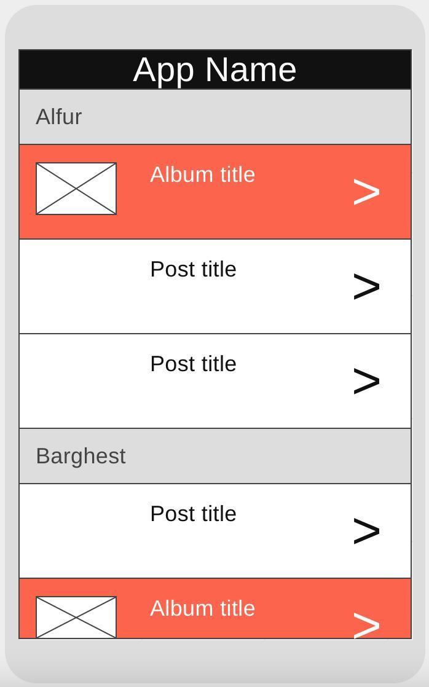

# Android Development Practice Project

## Functionality
- This app will pull posts and albums from an API (described below) and display them in a list
- Posts and albums will be organized by user (in alphabetical order by the `username` field)
- There will be a divider with the user's name before that user's posts and images (see wireframe below)
- Tapping on a post or album will take you to a detail page (TBD)

## Wireframe
Design choices are up to you, but the (very) rough idea is this:

## API
This app will use the [JSONPlaceholder API](https://jsonplaceholder.typicode.com/guide/)
Some key endpoints:
- https://jsonplaceholder.typicode.com/users for a list of all users
- https://jsonplaceholder.typicode.com/users/[userId]/posts for a list of a user's posts
- https://jsonplaceholder.typicode.com/users/[userId]/albums for a list of a user's albums
- https://jsonplaceholder.typicode.com/posts/[postId] for the details of a post (for the TBD detail page)
- https://jsonplaceholder.typicode.com/albums/[albumId] for the details of an album (for the TBD detail page)